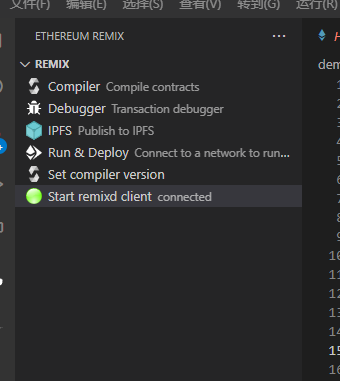
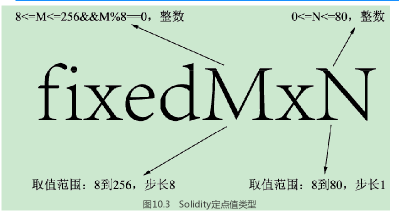

# 1：区块链	

### 1.1、区块链是什么

> 区块链是一种分布式账本技术，它可以在没有中心化管理机构的情况下，记录和验证各种类型的交易。它的本质是一个由多个节点组成的分布式网络，每个节点都可以看到整个网络上的交易记录。每个交易都被加密并打包成一个块，然后通过共识机制被添加到整个链中。这个过程使得区块链的交易记录具有防篡改性和去中心化的特性，因为每个节点都具有对交易记录的完整拷贝。

- 简单理解：**区块链是一个链条，这个链上一旦 发生了交易这个链上的所有人都知道并且记录，相当于一个账本**

# 2：以太坊

### 2.1、什么是以太坊

> 以太坊是一种基于区块链技术的智能合约平台，它允许开发者构建和部署去中心化应用程序（DApps）。与比特币等其他区块链不同，以太坊可以运行代码，这意味着它可以实现更为复杂的应用程序和智能合约。
>
> 以太坊的核心是“以太”，它是以太坊网络的本地加密货币，用于支付交易费用和奖励参与共识的矿工。但与比特币不同，以太可以通过编写智能合约来创建更为复杂的交易和应用程序。
>
> 以太坊的智能合约是使用 Solidity 等编程语言编写的，它们是以太坊上运行的自动化合约。这些合约被存储在以太坊区块链上，因此它们是去中心化、不可篡改的。
>
> 以太坊还具有自己的虚拟机（EVM），它是一种计算环境，可以在以太坊网络中执行智能合约。这意味着开发者可以使用 Solidity 或其他编程语言编写的代码，在 EVM 上运行智能合约。

# 3：solidity

## 3.1、什么是solidity语言

- **一门类似javascript的静态类型语言（如java）**

Solidity是一种智能合约编程语言，被广泛用于以太坊平台上的去中心化应用（DApps）开发。它类似于JavaScript，但是具有更多的安全特性和区块链特定的功能。

Solidity语言的主要特点包括：

1. 安全性：Solidity是为了编写智能合约而设计的，因此它具有很多内置的安全特性，可以帮助开发人员避免一些常见的漏洞和攻击。
2. 可编程性：Solidity是一种高级编程语言，它提供了诸如条件语句、循环、函数等常见的编程结构，使得开发人员可以轻松地编写复杂的智能合约。
3. 与以太坊集成：Solidity是以太坊平台上最流行的智能合约语言，它与以太坊虚拟机（EVM）集成，可以与以太坊上的其他智能合约、代币和其他DApps进行交互。
4. 可读性：Solidity语言的语法结构类似于JavaScript，使得开发人员可以更容易地阅读和理解现有的代码。


## 3.2、solidity智能合约执行过程

**图解1**


**图解2**


## 3.3、编写第一个智能合约

### 1）准备工作

1. 下载VsCode，
   - 并下载扩展solidity(**直接搜solidity就行**)
   - 并下载扩展remix

### 2）编写Hello World智能合约

**编写合约文件注意是后缀名是.sol**

```javascript
// SPDX-License-Identifier: MIT
pragma solidity >0.8.0;
contract HelloWorld {
    string messsage;  
	
    function getGreeting() public view returns (string memory) {
        return messsage;
    }

    function setGreeting(string memory _msg) public {
        messsage = _msg;
    }
}
```

#### 3）连接浏览器

**打开remix扩展，点击Start remixed client,开启客户端**



**然后再浏览器打开remix官方网站[https://remix.ethereum.org]，建议是chrome因为稳定，为什么不在浏览器直接编写，因为开发效率不快，Vscoode方便有各种插件支持。如果连接成功Vscode中的remix客户端图标是绿色的，如上图**


#### 4）编译、执行

**编译**


**执行**


## 3.4、语法

### 3.4.1） 变量

#### 1）状态变量

```java
pragma solidity >=0.5.0;
/**
*  状态变量
**/
contract StateVariableContract {
   string name;
   uint32 id;
}
上面代码中，name和id就是状态变量，这些变量在函数外部声明(例如类的属性)，并永久存储在以太坊区块链中。
```

#### 2）局部变量

局部变量（Local Variable）也叫本地变量，与后面我们说的局部变量是一样的。注意局部变量不仅仅是函数中的变量，参数也属于局部变量，包括入参和出参都是局部变量。

如下图所示为Solidity的状态变量与局部变量，状态变量只会出现在一个位置，局部变量可以是函数的入参、出参和函数体中定义的变量。


### 3.4.2）数据类型

#### 1）简介

 Solidity对数据有很多分类，最常用的是值类型和引用类型。分清楚值类型和引用类型很重要。

**值类型**

值类型主要包括如Booleans类型、Integers相关类型、Fixeds相关类型、Enum类型等各种字面量类型（除了数组字面量）。另外还有几个比较特殊的，如定长字节数组、合约类型、地址类型和函数类型。

**引用类型**

所有的引用类型，如数组和结构体类型，**都有一个额外注解数据位置 **，来说明数据存储位置。有三种位置：内存（memory）、存储（storage）以及调用数据（calldata）。调用数据仅对外部合约函数的参数有效，同时也是必须的。调用数据是不可修改的、非持久的函数参数

引用类型比较少，需要注意的是数组类型，其实字符串string和变长字节数组本质上也是一个数组，是一个字节数组（byte[]），只是做了特殊的处理而已。

#### 2）值类型

值类型的变量将始终按值来传递。 也就是说，当这些变量被用作函数参数或者用在赋值语句中时，总会进行**值拷贝**。

值类型主要包括如：

- 布尔类型
- 整型
- 定长浮点型
- 地址类型
- 合约类型
- 定长字节数组
- 地址字面常量
- 有理数和整数字面常量
- 字符串字面常量
- 十六进制字面常量
- 枚举类型
- 函数类型

##### 2.1）布尔类型

Booleans类型使用的关键字是**bool**，那为什么叫Booleans类型呢？Boolean包含两个值，一个是true，另一个是false，都是小写的，可以把它们当作是常量，并且也只能是常量true或者false。**Boolean类型不支持其他类型显式或者隐式地转换为Boolean类型**。什么意思呢？就是不支持下面这样的操作：

```java
if(1){
    return 1;
}if(-1){
    return 2;
}

```

**bool类型的操作符有：**

```java
！（逻辑非）；
&&（逻辑与）；
||（逻辑或）；
==（等值判断）；
！=（不等判断）。
```

##### 2.2）整型

- **整型类型主要包含无符号和有符号两大类，有符号就是区分正负，无符号就是不区分正负**。Solidity中的Integer类型和其他语言中不的Integers类型不一样，Solidity中还根据字节来区分，以有符号Integer类型为例：包含有int8、int16、int24…int256，最小为8，占1字节，最大为256，占32字节，以8位1字节为步长。

  为什么要区分这么细？因为以太坊的存储和计算都需要费用，这样可以更好地利用存储空间，减少费用。下面列举全部的Integer类型来感受一下：

  int8,int16,int24,int32,int40,int48,int56,int64,

  int72,int80,int88,int96,int104,int112,int120,int128,

  int136,int144,int152,int160,int168,int176,int184,int192,

  int200,int208,int216,int224,int232,int240,int248,int256,

  uint8,uint16,uint24,uint32,uint40,uint48,uint56,uint64,

  uint72,uint80,uint88,uint96,uint104,uint112,uint120,uint128,

  uint136,uint144,uint152,uint160,uint168,uint176,uint184,uint192,

  uint200,uint208,uint216,uint224,uint232,uint240,uint248,uint256

  注意：int是int256的缩写，uint是uint256的缩写

- **Integers类型支持的运算符**

  - 比较操作符：<= ，<， ==，!=，>=，>（返回布尔值）；
  - 位操作符：&，|，^（异或），~（位取反）;
  - 算术运算符：+，-，一元运算- 一元运算+，*，/，%（取余或叫模运算），**（幂）
  - 移位操作符：<<（左移位），>>（右移位）。

- **Integers整除问题**

  - 在Solidity中，当两个整数相除时，它们之间的除法运算会向下取整并返回一个整数结果。这意味着如果你执行10/3的操作，结果将会是3而不是3.33或4。同样地，如果你执行11/2的操作，结果将会是5而不是5.5或6。

    另外，在Solidity中进行整数除法也有另外一种语法：你可以使用“div”函数。例如：x.div(y) 表示x除以y并将结果向下取整为整数。同时，还有一个“mod”函数用于计算余数（即模运算）。

##### 2.3）**定长浮点型**

- Solidity中的定长浮点型不同于float和double，不过Solidity对于定点数的支持还不完善，可以声明定长浮点型的变量，但不能给它们赋值或把它们赋值给其他变量。

- **定点数也分为有符号类型和无符号类型两大类**，使用ufixedMxN和fixedMxN的形式来定义，M代表整数部分的位数，N代表小数部分的位数。M的取值范围是8～256，步长为8，N的取值范围为0～80，包含0和80，步长为1，都是整数。

  ​	

- **定点数类型支持的运算符**

  - 比较操作符：<=，<，==，!=，>=，>（返回值是布尔型）
  - 算术操作符：+，-， 一元运算-，一元运算 +，*，/，%（取余数）。

  - 注意：Solidity的定点数还没有实现，现阶段还不能使用。

##### 2.4）地址类型

- 地址类型有两种形式:
  - address：保存一个20字节的值（以太坊地址的大小）。
  - ddress payable：可支付地址，与address相同，不过有成员函数**transfer和send**。

**区别在于address payable可以接受以太币的地址，而一个普通的address则不能。address可以转换为address payable**

```java
pragma solidity >0.8.0;
/*
    测试合约
*/
contract Test{
    /*
        测试地址类型
    */
    address public address1 = msg.sender;  //地址类型
    address payable public address2 = payable(address1);   //地址类型强转为可支付地址
}
```

- **运算符**
  - 地址类型支持的运算符包括<=、<、==、!=、>=、>。
- **成员变量：地址类型和整形等基本类型不同，它拥有自己的成员属性和函数**
  - balance
  - transfer
  - send
  - call
  - delegatecall
  - staticcall


**最重要的是balance、transfer和send，balance是地址类型的一个属性，表示地址关联的账户剩余以太币。transfer和send用来发送以太币，**transfer和send用来发送以太币，例如合约A要给地址addrB发送一个以太币，就可以在A合约中调用addrB.transfer（1 ether）。当使用transfer时，如果以太币不够，或是遇到其他错误，都会抛出一个异常。send也可以发送以太币，但是相对于transfer更加底层一些，send遇到错误不会抛出异常，而是返回false，如：

```java
pragma solidity >=0.8.0;
/**
 */ 
contract AddressTest {
    event log(string msg);
    // payable 构造函数表示创建合约时可以接收以太币  
    //关键就在于这个payable这个关键字，他表示这个合约可以接收以太币
    constructor() public payable {}
    
    function getBanlance() public  view   returns(uint){  
        //返回当前合约余额剩余多少以太币
        return  address(this).balance;
    }

    function set(address payable a1,uint a2) public  payable {
        a1.transfer(a2);
    }
    /*
        try-catch语句块不能对内部函数使用，也就是不是我们编写的函数
        引用自己写的方法必须带this
    */
    function setBanlance(address payable var1,uint var2) public  payable {
        try this.set(var1, var2){
           emit log("success");
        }catch {
            emit  log("fail !!!!!!");
        }
    }
    /*
    当前合约向指定地址转100wei
    
    */
	 function transferTo(address payable  ad) public payable {
        uint amount = 100;
        
        ad.transfer(amount);
    }
    
    /*
        向指定账户转以太币，没有特别的
        takeOverAddress : 接收以太币的地址
        amount ： 向指定地址转多少以太币
        当前合约是发送以太币的
    */
    function sendTo(address payable takeOverAddress,uint amount) public payable  returns(uint){
        if (takeOverAddress.send(amount)){
            emit log("success");
            return  1;
        }else {
            emit  log("fail !!!!!!");
            return  0;
        }
    }
    
}
```

- call：用给定的有效载荷（payload）发出低级 CALL 调用，返回成功状态及返回数据，发送所有可用 gas，也可以调节 gas。
- callcode与delegatecall：用给定的有效载荷 发出低级 DELEGATECALL 调用 ，返回成功状态并返回数据，发送所有可用 gas，也可以调节 gas。 发出低级函数 DELEGATECALL，失败时返回 false，发送所有可用 gas，可调节。
- Staticcall：用给定的有效载荷 发出低级 STATICCALL 调用 ，返回成功状态并返回数据，发送所有可用 gas，也可以调节 gas。

##### 2.5）**合约类型**

- 以一个合约为成员

- **合约类型的成员是合约的外部函数及 public 的 状态变量。**

##### 2.6）**定长字节数组**

- **定长字节数组类型**

  - 和整型一样，定长字节数组也按占用的字节长度分为很多类型，值类型为 bytes1，bytes2，bytes3，...，bytes32保存从1到最多32个字节的序列。

    注意：bytes1不是byte1，byte是bytes1的别名。

    bytes1占用1个字节，bytes2占用2个字节，以此类推，bytes32占用32个字节，也就是256位。

- **定长字节数组支持的运算符**

  - 比较运算符：<=、<、==、！=、>=、>；
  - 位操作符：&、|、^、~、<<、>>；
  - 索引访问：array[index]。

  定长字节数组的运算符中，最常用的是索引访问，定长字节数组**只能读取数据，不能修改数据，包括数组的长度也不能修改**。

- **定长字节数组的成员**

  - 定长字节数组只有一个成员length，它是定长字节数组的属性，这个length指的是数据占用的字节数，而不是数据实际使用的字节数。	

- **定长字节数组与字符串**

  - 下面通过例子来看一下怎样将字符串赋值给定长字节数组，在定长字节数组中如何存储字符串内容。示例如下：

    ```java
    pragma solidity >=0.5.0;
    /**
     * @title FixedBytesStringContract
     * @dev 定长字节数组测试
     */
    contract FixedBytesStringContract {
      // 字符串字面量存储在定长字节数组中
      bytes12 public hello = "hello,中国";
      /**
       * @dev 获取指定字节位置的数据
       */ 
      function getByte(uint8 index) public view returns(byte){
         return hello[index];
      }
      /**
       * @dev 获取最后一个字节数据
       */ 
      function getLastByte() public view returns(byte){
            return hello[hello.length - 1];
      }
    }
    ```

- **定长字节数组之间的转换**

  - 一般我们会在使用的时候会尽量选择合适的字节数组，但还是会遇到需要进行在定长字节数组之间转换的情况。下面通过例子来学习一下定长字节数组间的转换问题：

    ```java
    pragma solidity >=0.5.0;
    /**
     * @title BytesConvertContract
     * @dev 定长字节数组转换测试
     */
    contract BytesConvertContract {
      bytes3 public numA = 0x112233;
      bytes2 public numB = 0x1122;
      /**
       * @dev 低字节转换为高字节，低位补0
       */ 
      function lowToHight() public view returns(bytes3){
          return bytes3(numB);
      }
      /**
       * @dev 高字节转换为低字节，低位截断
       */ 
      function hightToLow() public view returns(bytes2){
          return bytes2(numA);
      }
    }    
    ```

##### 2.7）**变长字节数组**

- 变长字节数组使用的关键字是bytes，注意不要和bytes1混淆，bytes1是一个字节的定长字节数组。前面我们介绍过string类型，或称为字符串字面量类型，其实string类型就是一个特殊的变长字节数组，string字符到字节使用的是UTF-8编码。

  其实变长字节数组bytes和string都是特殊的byte[]类型，即字节数组类型，不过bytes和string都不是值类型，而是引用类型。

  既然定长字节数组、bytes和string相似，那么怎样选择？从存储成本考虑，如果不确定数据字节大小的情况下，可以使用string或者bytes，如果知道或能将字节控制在bytes1~bytes32，那么就可以考虑选择bytes1~bytes32之间的定长字节数组。

- **创建变长字节数组**

  - 通过前面的介绍变长字节数组是一个引用类型，所以不能直接赋值，需要先创建：

    ```java
    pragma solidity >=0.5.0;
    /**
    *  变长字节数组测试
    **/
    contract DynamicBytesContract {
        // bytes public bytesA = 255;
        // bytes public bytesA = bytes(byte(255));
        // bytes public hexNum = 0x112233;
        bytes public hello = "hello";         //字符串赋值给变长字节数组
        bytes public hexLiteral = hex"112233";//十六进制字面量赋值给变长字节数组
        bytes public bytesB = new bytes(2);      //使用new关键字创建变长字节数组
    }
    ```

- **变长字节数组成员**

  - 对比定长字节数组的成员，变长字节数组成员显得实用很多，本节我们就来了解一下变长字节数组的成员和操作。示例如下：

    ```java
    pragma solidity >=0.5.0;
    /**
     * @title DynamicBytesContract
     * @dev 变长字节数组测试
     */
    contract DynamicBytesContract {
        //创建变长字节数组
        bytes public num = new bytes(2);
        /**
         * @dev 通过length成员获取变长字节数组长度
         */ 
        function getNumLength() public view returns(uint256){
            return num.length;
        }
        /**
         * @dev 变长字节数组长度可以改变
         */ 
        function setNumLength(uint8 len) public{
            num.length = len;
        }
        /**
         * @dev 通过push成员为变长字节数组添加数据，长度自动变化
         */ 
        function addData(bytes1 data) public{
            num.push(data);
        }
        /**
         * @dev 通过下标修改变长字节数组数据
         */ 
        function modify(bytes1 data,uint256 index) public{
            num[index] = data;
        }
    }
    ```

**注意：**变长字节数组的push成员总是将数据添加到最后，修改变长字节数组的length的值时有两种情况，一种是变小，会截取掉变长字节数组的低位；一种是变大，新添加的字节在低位使用填充0。

- **字节数组间的转换**

  - 本节介绍定长字节数组、变长字节数组和字符串之间的相互转换的问题。示例如下：

    ```java
    pragma solidity >=0.5.0;
    /**
     * @title ConvertContract
     * @dev 定长字节数组、变长字节数组、字符串转换测试
     */
    contract ConvertContract {
        //变长字节数组
        bytes public bytesHello = "hello";
        //定长字节数组
        bytes5 public bytes5Hello = "hello";
        //字符串
        string public hello = "hello";
        /**
         * @dev 字符串转换为变长字节数组
         */ 
        function stringToBytes() public view returns(bytes memory){
            return bytes(hello);
        }
        ///字符串不能强制转换为定长字节数组
        // function stringToFixByteArray() public pure returns(bytes5){
        //     return bytes5(hello);
        // }
        ///定长字节数组不能强制转换为字符串
        // function fixByteArrayToString() public view returns(string){
        //     return string(bytes5Hello);
        // }
        ///定长字节数组不能强制转换为变长字节数组
        // function fixByteArrayToBytes() public view returns(bytes){
        //     return bytes(bytes5Hello);
        // }
        
        ///变长字节数组不能强制转换为定长字节数组
        // function bytesToFixByteArray() public view returns(bytes5){
        //     return bytes5(bytesHello);
        // }
         /**
         * @dev 变长字节数组可以转换为字符串
         */ 
        function bytesToString() public view returns(string memory){
            return string(bytesHello);
        }
    }
    ```

  我们知道，**定长字节数组是一个值类型，变长字节数组和字符串是一个引用类型**，它们的存放位置可能不同。为什么要这么限制，是因为定长字节数组在初始化之后不能修改长度和对应的值，这样就没有办法动态生成一个定长字节数组，然后把值添加进去。

  如下表所示为字节数组与字符串数组是否能够相互转换的说明。读者只要记住一点，**定长字节数组初始化之后就不能被修改了，**那么表中的内容就容易理解了。

  

##### 2.8）**字面量**

- 字面量在Solidity中是一个重要的概念，因为Solidity中也有很多字面量类型，例如字符串字面量、整型字面量，十六进制字面量和地址字面量等。很多字面量类型都有对应的数据类型，但字面量类型其对应的数据类型之间有些差别。本节介绍Solidity中常见的字面量，以及其对应的数据类型的差别。

- **字符串字面量**

  - 字符串字面常量是指由双引号或单引号引起来的字符串（"foo" 或者 'bar'）。 不像在 C 语言中那样带有结束符；"foo" 相当于 3 个字节而不是 4 个。 和整数字面常量一样，字符串字面常量的类型也可以发生改变，但它们可以隐式地转换成 bytes1，……，bytes32，如果合适的话，还可以转换成bytes以及string。

    例如：

    bytes32 samevar = "stringliteral"

    字符串字面常量在赋值给 bytes32 时被解释为原始的字节形式。

    Solidity中的字符串字面量也支持转义字符，例如\n、\xNN和\uNNNN等。\xNN表示的是十六进制值，在内存中存放的也是十六进制值。\uNNNN表示的是Unicode的码位，存储的时候存储的是对应的UTF-8编码。下面看一个实例：

  ```java
  pragma solidity >=0.5.0;
  /**
   * @title StringLiteralContract
   * @dev 字符串字面量测试
   */
  contract StringLiteralContract {
     string public A = "\x41";                  //使用\x方式
     string public unicodeZhong = "\u4e2d";         //使用Unicode方式
     string public zhong = "中";
     /**
      * 获取\x41对应值
      */ 
     function getANum() public view returns(uint8) {
        return uint8(bytes(A)[0]);//强制转换为bytes类型，然后取低字节转换为uint8
     }
  }
  ```

- **十六进制字面量**

  - 十六进制字面量就是使用hex关键字作为前缀的字符串字面量，但是必须是十六进制字符串格式。

    例如，hex"7E7D7C7B7A706F"，十六进制字面量和字符串字面量的"\x"差不多，不过"\x"只能表示一个字节，hex可以表示多个字节。另外，hex是关键字，在字符串外，"\x"是转义符号在字符串里面。下面我们来看一个十六进制字面量的实例：

    ```java
    pragma solidity >=0.5.0;
    /**
     * 十六进制字面量测试
     */
    contract HexLiteralContract {
       string public hexv = hex"7E7D7C7B7A706F";
       function getHexvNum() public view returns(uint8 _7e,uint8 _7d,uint8 
       _7c,uint8 _7b,uint8 _7a,uint8 _70,uint8 _6f){
           bytes memory b = bytes(hexv);
           _7e = uint8(b[0]);
            _7d = uint8(b[1]);
            _7c = uint8(b[2]);
            _7b = uint8(b[3]);
            _7a = uint8(b[4]);
            _70 = uint8(b[5]);
            _6f = uint8(b[6]);
       }
    }
    ```

- **地址字面常量**

  - 比如像 0xdCad3a6d3569DF655070DEd06cb7A1b2Ccd1D3AF 这样的通过了地址校验和测试的十六进制字面常量会作为 address payable 类型。

- **有理数和整数字面常量**

  - 整数字面常量由范围在 0-9 的一串数字组成，表现成十进制。 例如，69 表示数字 69。 Solidity 中是没有八进制的，因此前置 0 是无效的。

    十进制小数字面常量带有一个 .，至少在其一边会有一个数字。比如：1.，.1，和 1.3。

    科学符号也是支持的，尽管指数必须是整数，但底数可以是小数。比如：2e10，-2e10，2e-10，2.5e1。

    为了提高可读性可以在数字之间加上下划线。 例如，十进制``123_000``，十六进制 0x2eff_abde，科学十进制表示1_2e345_678都是有效的。 下划线仅允许在两位数之间，并且不允许下划线连续出现。添加到数字文字中下划线没有额外的语义，下划线会被编译器忽略。

    数值字面常量表达式本身支持任意精度，除非它们被转换成了非字面常量类型（也就是说，当它们出现在变量表达式中时就会发生转换）。 这意味着在数值常量表达式中, 计算不会溢出而除法也不会截断。

    例如，(2**800+1)-2**800的结果是字面常量1（属于uint8类型），尽管计算的中间结果已经超过了以太坊虚拟机的机器字长度。此外，.5 * 8 的结果是整型4（尽管有非整型参与了计算）。

##### 2.9）**枚举类型**

- **枚举类型简介**

  - 枚举类型是Solidity中的一种用户自定义类型，可以显式地转换为整型，但不可用隐式转换，枚举类型中至少有一个元素。

    其实枚举类型就是对应的无符号整型，根据枚举类型中的个数，会自动转换为uint8，uint16……uint256。

- **枚举类型实例**

  ```java
  pragma solidity >=0.5.0;
  /**
   * @title EnumContract
   * @dev 枚举示例
   */ 
  contract EnumContract {
      enum ActionChoices { GoLeft, GoRight, GoStraight, SitStill }
      ActionChoices choice;
      ActionChoices constant defaultChoice = ActionChoices.GoStraight;
      function setGoStraight() public {
          choice = ActionChoices.GoStraight;
      }
      // 由于枚举类型不属于 |ABI| 的一部分，因此对于所有来自 Solidity 外部的调用，
      // "getChoice" 的签名会自动被改成 "getChoice() returns (uint8)"。
      // 整数类型的大小已经足够存储所有枚举类型的值，随着值的个数增加，
      // 可以逐渐使用 `uint16` 或更大的整数类型。
      function getChoice() public view returns (ActionChoices) {
          return choice;
      }
      function getDefaultChoice() public pure returns (uint) {
          return uint(defaultChoice);
      }
  }
  
  ```

##### 2.10）**函数类型**

- **函数类型简介**

  - 函数类型不是函数而是一种类型，像是uint8的类型。因为这种函数类型容易和函数混淆，前面没有详细介绍，本节我们就来详细介绍函数类型的使用。

  - 函数类型内容比较多，这里尽量简化介绍。首先我们来看一下函数类型的定义：

    ```java
    function (<parameter types>) {internal|external} [pure|constant|view|payable] [returns (<return types>)]
    ```

  - 函数类型本身是一个特殊的变量，可以当作变量赋值，当作函数参数传递，当作返回值，包括两种类型：

    - 内部类型（internal）：仅能在合约内部调用，如当前代码块中，内部库函数中，继承的函数中；
    - 外部类型（external）：由地址和函数签名两个部分组成，可作为外部函数调用的参数，或者由外部函数调用返回。

- 参考以下例子：

  ```java
  pragma solidity >=0.5.0;
  /**
   * @title FunctionContract
   * @dev 函数类型
   */ 
  contract FunctionContract{
      uint public v1;
      uint public v2;
      
      function internalFunc() internal{
          v1 = 10;
      }
   
      function externalFunc() external returns (uint res){
          v2 = 20;
          return v2;
      }
   
      function resetV2() public {
          v2 = 0;
      }
   
      function callFunc() public {
          //直接使用内部的方式调用
          internalFunc();  //<--- 合约内部直接调用，正确
   
          //不能在内部调用一个外部函数，会报编译错误。
          //Error: Undeclared identifier.
          //externalFunc(); //<--- 外部合约不可以调用
   
          //不能通过`external`的方式调用一个`internal`
          //Member "internalFunc" not found or not visible after argument-dependent lookup in contract FuntionTest
          //this.internalFunc();  //<--- this.相当于外部调用
   
          //使用`this`以`external`的方式调用一个外部函数
          this.externalFunc();
      }
  }
  // 合约的继承
  contract FunctionTest1 is FunctionContract {
      function callInternalFunc()  public{
          internalFunc();  // 可以继承父合约的内部方法
          this.externalFunc();
      }
  }
   
   
  contract FunctionTest2{
      uint public v3;
      function externalCall(FunctionContract ft) public {
          //调用另一个合约的外部函数
          v3 = ft.externalFunc();
   
          //不能调用另一个合约的内部函数
          //Error: Member "internalFunc" not found or not visible after argument-dependent lookup in contract FuntionTest
          //ft.internalFunc();
      }
   
      function resetV3() public {
          v3 = 0;
      }
  }
  
  ```

#### 3）引用类型

- 引用类型可以通过多个不同的名称修改它的值，而值类型的变量，每次都有独立的副本。因此，必须比值类型更谨慎地处理引用类型。

  目前，引用类型包括数组、映射和结构体，如果使用引用类型，必须明确指明数据存储哪种类型的位置：

  - **memory内存**：其生命周期只存在与函数调用的期间；
  - **storage存储**：状态变量保存的位置，一直存在区块链中；
  - **calldate调用数据**：函数参数的特殊数据位置，仅适用于外部函数调用参数。

  更改数据位置或类型转换将始终产生自动进行一份拷贝，而在同一数据位置内（对于存储来说）的复制仅在某些情况下进行拷贝。

##### 3.1）数据位置

- 每一个复杂类型都有一个额外的标注，这个标注就叫做数据位置，表示数据存储在memory中还是storage中。数据位置标注非常重要，它关系到了变量之间赋值行为的问题。

  在0.5.0及其以后的版本中必须显式地申明数据位置标注。

- **memory简介**

  - memory存储数据保留了前4个32字节，就是前面的128字节可以看做是metadata数据。memory存储数据主要包含的数据是：0x00-0x3F这64字节是哈希方法的暂存空间；0x40-0x5F这32个字节是存放的是当前已经分配的memory的大小，也就是下一个分配空间的开始位置；0x60-0x7F这32字节用于存放动态memory数组的初始值。

    所以memory存储的数据是从0x80开始的，memory总是重新分配内存，而不会释放内存，例如前面有一个变量分配的内存没有使用，后面一个相同类型的变量并不会利用之前不使用的空间，而是从新分配新的空间。

- **storage简介**

  - 相对于memory数据位置标注来说，storage数据位置标注就复杂一些，使用storage位置标注的变量会存储在EVM的storage区域，在交易执行之后，storage区域的数据会被写回到合约账户的storage中。

    storage标注的变量在内存中的存储格式可以分为两大类，一类是Mapping类型和动态大小数组（T[]，bytes，string）变量；另一类是静态大小类型变量，也就是除了Mapping和T[]类型的其他类型变量。

    我们先来看storage的静态大小类型变量的存储，这类变量会从第一个slot开始存放，一个slot是32字节，如果变量类型小于32字节，那么会把多个变量打包为一个后存放在一个slot中。打包的规则如下：

    （1）每一项都按低位对齐。

    （2）基本类型只使用它需要的字节，例如uint8只使用1个字节。

    （3）如果slot余下的字节不能存放一个基本类型，就会存放到下一个slot中。例如前面有一个uint248，后面有一个uint16，它们不会打包在同一个slot中，uint248会占用一个slot，空余一个字节，uint16会存放到下一个slot中。

    （4）struct和array类型总是从一个新的slot开始存储，但是struct和array内部的数据还是会按前面的打包规则打包。

    注意：使用小于32字节的类型，可能花费更多gas，因为EVM的stack的slot是32字节，因此小于32字节的类型在运行的时候会需要更多的操作。

- **calldata简介**

  - Sloidity中除了前面介绍的两种数据位置之外，其实还有第3种数据位置，就是calldata，其使用非常少。calldata数据位置标注的数不能被修改也不能持久化。calldata的行为非常像memory，但只用于external函数的入参，并且external函数的入参必须是calldata标注。

- **小结**

  - 很多操作会因为数据位置有限制，所以这里我们先对Solidity数据位置的这些限制做一些总结。首先我们做一个定义，把一个函数的传入参数称为入参，函数的返回参数称为出参，那么得到结论，

    强制数据位置类型：

    - **可见性为external的函数入参的数据类型（Data Location）必须是calldata类型。**
    - 状态变量的数据位置（Data Location）类型必须是storage类型。

    默认数据类型：

    - **一个函数的入参和出参的数据位置（Data Location）类型默认是memory类型。（external函数的入参除外，因为强制为calldata类型）**
    - **除了入参和出参之外（上一条）的所有局部变量的数据位置（Data Location）类型默认为storage。**

##### 3.2）数组

- 在Solidity中数组使用非常多，如前面介绍的string、bytes、bytes1-bytes32本质上都是数组。数组可以是固定长度，也可以是动态长度，数组中的数据类型可以是任意类型，不过对于不同位置有一些限制，本节我们就来详细介绍一下Solidity数组相关的内容。

- **固定长度数组:固定长度数组，顾名思义就是不能修改数组的长度，但可以修改数组内容。数组有一个属性成员length可以获取数组的长度，我们来看一个例子，了解一下固定长度数组。**

  ```java
  pragma solidity >=0.5.0;
  /**
   * @title FixedArrayContract
   * @dev 固定长度数组
   */
  contract FixedArrayContract {
      //声明固定长度数组
      uint8 [5] array = [1,2,3,4,5];
      /**
       * @dev 计算固定长度数组中值的和
       */ 
      function sum() public view returns (uint8) {
          uint8 result = 0;
          for(uint i = 0; i < array.length; i++) {
              result += array[i];
          }
          return result;
      }
      ///固定长度数组长度不可变
      // function modifyLength(uint len) public{
      //     array.length = len;
      // }
      /**
       * @dev 可以通过length成员获取固定长度数组长度
       */ 
      function getArrayLength() public view returns(uint){
          return array.length;
      }
      /**
       * @dev 可以通过下标修改固定长度数组值，这一点和定长字节数组不同
       */ 
      function setArrayValue(uint index,uint8 val) public{
          array[index] = val;
      }
  }
  ```

- **动态长度数组:和固定长度数组相似的就是动态长度数组，但是动态长度数组可以修改数组的长度，并且多了一个可以使用的成员函数push，就是在数组最后追加一个元素。下面来看一个动态长度数组的例子：**

  ```java
  pragma solidity >=0.5.0;
  /**
   * @title DynamicArrayContract
   * @dev 动态长度数组
   */
  contract DynamicArrayContract {
      //声明动态长度数组，初始化时不指定数组长度
      uint8 [] array = [1,2,3,4,5];
      /**
       * @dev 求动态数组累加和
       */ 
      function sum() public view returns (uint8) {
          uint8 result = 0;
          for(uint i = 0; i < array.length; i++) {
              result += array[i];
          }
          return result;
      }
      /**
       * @dev 使用push成员为动态数组添加元素
       */ 
      function pushElement(uint8 val) public{
          array.push(val);
      }
      /**
       * @dev 动态长度数组可以修改长度
       * @notice 注意长度变大和变小的不同
       */
      function getArrayLength() public view returns(uint){
          return array.length;
      }
      /**
       * @dev 可以通过下标访问修改动态数组元素
       */ 
      function setArrayValue(uint index,uint8 val) public{
          array[index] = val;
      }
  }
  ```

- **小结**

  - 动态长度数组和固定长度数组非常相似，对比一下定义：

    uint8 [] array = [1,2,3,4,5];

    uint8 [5] array = [1,2,3,4,5];

    二者的区别是，动态长度数组可以通过push添加元素，添加元素一定是在数组的最后，另外动态数组可以修改数组长度，修改长度之后，除了指定长度之内的元素，其他元素都被删掉，读者一定要注意这一点，不是重置，而是删除。

- **二维数组**

  - Solidity也支持二维数组，不过与其他开发语言不同的是Solidity指定行和列的顺序相反。Solidity是先指定列，再指定行，下面看一个实例：

  ```java
  pragma solidity >=0.5.0;
  /**
   * @title TwoDimentionArrayContract
   * @dev 二维数组
   */
  contract TwoDimentionArrayContract {
      //声明二维数组，注意行列关系
      uint8 [3][2] arrays = [[1,2,3],[4,5,6]];
      bytes public result;
      /**
       * @dev 获取二维数组长度
       */ 
      function getArraysLength() public view returns (uint) {
          return arrays.length; 
      }
      /**
       * @dev 将二维数组元素push到变长字节数组result中
       */ 
      function getArraysString() public returns(bytes memory){
          for(uint i=0;i<arrays.length;i++){
              uint8[3] storage arrs = arrays[i];
              for(uint j=0;j<arrs.length;j++){
                  result.push(byte(arrs[j]));
              }
          }
          return result;
      }
  }
  ```

- **小结**

  - 先看二维数组的定义：

    uint8 [3][2] arrays = [[1,2,3],[4,5,6]];

    可以看到先定义的是列，后定义的是行，是一个3列2行的二维数组，但访问时还是先访问行，例如通过length获取数组的长度，返回的是数组有多少行。

    通过getArraysString中的代码和返回值也可以证明对于二维数组的访问和其他语言一样，先读取行，然后再读取列，只是定义时顺序相反。

##### 3.3）**映射类型**

- **mapping类型简介**

  - 映射是一种引用类型，存储键值对。它的定义是：**mapping(key => value)**，概念上与java中的map，python中的字典类型类似，但在使用上有比较多的限制。

  - 其中key 可以是除了mapping、动态数组、合约、枚举、结构体、stirng之外的所有类型。而value可以是任何类型，甚至可以是mapping类型本身。

  - mapping可以被当作是一个被初始化的Hash表，通过任何值作为键都能获取到对应的值。如果键存在并且设置了对应的值，那么获取到的就是值本身，如果键不存在或者还没有设置对应的值，那么获取到的值就是0字节或值类型对应的默认值。mapping其实并没有存储key数据，而是存放key的keccak256哈希值，用来查找value，因此对于mapping来说没有设置长度、键或值的概念。

    mapping类型只能用于状态变量，或者作为internal函数的storage标注类型的引用。

- **mapping类型实例**

  - mapping类型可以被设置为public类型，Solidity会为它创建一个getter，_KeyType是一个必须参数，用于获取对应的_ValueType。下面我们来看一个mapping类型的实例：

    ```java
    pragma solidity >=0.5.0;
    contract MappingExample{
        mapping(uint => string) public names;
        
        function update() public{
            names[1] = "tom";
            names[2] = "allen";
            names[3] = "alice";
            names[4] = "jamse";
            names[5] = "simith";
        }
    }
    ```

**注意：mapping不能迭代。**

##### 3.4）**结构体**

- struct类型很多时候也被称为结构体，Solidity使用struct来自定义数据类型，和C语言中的struct一样，在struct中可以包含任何类型。**值得注意的是struct类型不能做作为参数**，作为返回值也**只能在internal修饰的函数中**，**其他函数中struct都不能作为返回值。**

- 例子：

  ```java
  pragma solidity >=0.5.0;
  /**
   * @title StructContract
   * @dev struct 示例
   */ 
  contract StructContract {
      //使用struct定义结构体
      struct Student{
          uint8 id;
          string name;
      }
      Student public tom ;
      Student public alice;
      constructor() public{
          //创建结构体的时候不需要new关键字
          tom = Student(1,"tom");
          //如果不按顺序，可以使用{}对象指定属性和对应的值
          alice = Student({name:"alice",id:2});
      }
      function getTomeId() public view returns(uint8){
        return tom.id;
      }
      function getAliceName() public view returns(string memory){
        return alice.name;
      }
      // function getTom() public view returns(Student){
      //     return tom;
      // }
      /**
       * @dev internal函数才能使用结构体做返回参数
       */ 
      function getAlice() internal view returns(Student memory){
          return alice;
      }
  }
  ```

#### 4）类型转换

**1）基本类型之前的转换**

- **隐式转换**

  - **隐式转换一般是低类型向高类型转换**，例如uint8转换为uint16，bytes1转换为bytes2这类转换，这类转换不会发生数据的截断，可以放心转换，编译也不会报错，有时就是给一个编译警告。示例如下：

  ```java
  pragma solidity >=0.5.0;
  /**
  *  类型转换
  **/
  contract ConvertContract {
      bytes1 public byteNumOne = "\x07";
      bytes2 public byteNumTwo = byteNumOne;
      uint8 public uint8Num = 255;
      uint16 public uint16Num = uint8Num;
      // int8 public int8Num = 127;
      // uint16 public uint16Num = uint16(int8Num);
      bytes2 public byteNumA = 0x1122;
      // bytes1 public byteNumB = byteNumA;
      bytes1 public byteNumB = bytes1(byteNumA);
  }
  ```

- **显式转换**

  - **显式转换一般用在大类型转为小类型时**，或者不同类型之间的转换时，必须强制指定类型进行转换。显式类型转换一般会发生数据截断，这样就不允许隐式转换，必须进行显式转换，所以一定要考虑清楚显式转换会带来的影响。

  ```java
  pragma solidity >=0.5.0;
  /**
  *  类型转换
  **/
  contract ConvertContract {
      bytes2 public b1 = 0x1122;
      bytes1 public b2 = bytes1(b1);
      uint16 public numA = 0xFF00;
      uint16 public numC = 0x00FF;
      uint8 public numB = uint8(numA);
      uint8 public numD = uint8(numC);
  }
  ```

**2）字面常量与基本类型的转换**

- **整型与字面常量转换：十进制和十六进制字面常量可以隐式转换为任何足以表示它而不会截断的整数类型**

- **定长字节数组与字面常量转换：十进制字面常量不能隐式转换为定长字节数组。十六进制字面常量可以是，但仅当十六进制数字大小完全符合定长字节数组长度。不过零值例外，零的十进制和十六进制字面常量都可以转换为任何定长字节数组类型:**

  ```java
  pragma solidity >=0.5.0;
  /**
  *  类型转换
  **/
  contract ConvertContract {
      // bytes2 a = 54321; // 不可行
      // bytes2 b = 0x12; // 不可行
      // bytes2 c = 0x123; // 不可行
      bytes2 d = 0x1234; // 可行
      bytes2 e = 0x0012; // 可行
      bytes4 f = 0; // 可行
      bytes4 g = 0x0; // 可行
  }
  ```

  字符串字面常量和十六进制字符串字面常量可以隐式转换为定长字节数组，如果它们的字符数与字节类型的大小相匹配:

  ```java
  pragma solidity >=0.5.0;
  /**
  *  类型转换
  **/
  contract ConvertContract {
      bytes2 a = hex"1234"; // 可行
      bytes2 b = "xy"; // 可行
      // bytes2 c = hex"12"; // 不可行
      // bytes2 d = hex"123"; // 不可行
      // bytes2 e = "x"; // 不可行
      // bytes2 f = "xyz"; // 不可行
  }
  ```

- **地址类型：通过校验和测试的正确大小的十六进制字面常量会作为address类型。没有其他字面常量可以隐式转换为address类型。从bytes20或其他整型显示转换为address类型时，都会作为address payable类型。**

#### 5）delete运算符

- delete运算符在Solidity中也是使用比较多的运算符。delete运算符对不同的类型有不一样的行为。       

**1）delete与常见类型**

- delete运算符执行的删除操作更像是重置操作，**会把变量重置为默认值**，我们来看一个具体的例子。示例如下：

  ```java
  pragma solidity >=0.5.0;
  /**
  *  delete
  **/
  contract DeleteContract {
      uint8 public num = 10;
      string public name = "tim";
      bool public isNotDelete = true;
      enum Language{
          Solidity,C,Python
      }
      Language public used = Language.Python;
      function testDelete() public{
         delete num; 
         delete name;
         delete isNotDelete;
         delete used;
      }
  }
  ```

**2）delete与数组**

- delete运算符对于固定长度数组和动态长度数组的操作还是有区别的，我们还是先来看一个实例：

  ```java
  pragma solidity >=0.5.0;
  /**
   * @title DeleteContract
   * @dev delete 与数组
   */
  contract DeleteContract {
      uint8 [3] public array   = [1,2,3];
      uint8 [] public dynamicArray = [1,2,3,4,5];
      /**
       * @dev delete 作用于数组
       */ 
      function testDelete() public{
         delete array;
         delete dynamicArray;
      }
      /**
       * @dev 固定大小数组重置元素
       */ 
      function getArrayLength() public view returns(uint){
          return array.length;
      }
      /**
       * @dev 动态大小数组会将长度重置为0
       */ 
      function getDynamicArrayLength() public view returns(uint){
          return dynamicArray.length;
      }
  }
  ```

**数组中的元素都会被重置，不过对于动态数组会让数组的长度变为0，对于固定长度数组，不会改变数组长度。**

**3）delete与mapping**

- 对于mapping来说，直接delete一个mapping类型的变量是无效的操作，会得到警告

  ```java
  pragma solidity >=0.5.0;
  /**
   * @title DeleteMappingContract
   * @dev delete 与mapping
   */
  contract DeleteMappingContract {
      mapping(uint8=>string) public names;
      //构造函数初始化mapping
      constructor() public{
          names[1] = "tom";
          names[2] = "alice";
      }
      ///delete不能直接作用于mapping
      function testDelete() public{
      //   delete names;
      }
      /**
       * @dev delete作用于mapping的key，重置元素
       */ 
      function deleteMapping(uint8 key) public{
          delete names[key];
      }
  }
  ```

**其实执行的就是mapping键对应的值重置。**

**4）delete与struct**	

- 对应结构体struct来说，delete会重置结构体中的每一个元素。下面还是来看一个具体例子：

  ```java
  pragma solidity >=0.5.0;
  /**
   * @title DeleteStructContract
   * @dev delete 与结构体
   */
  contract DeleteStructContract {
      //定义结构体
      struct Student{
          uint8 id;
          string name;
      }
      //创建一个Student
      Student public tom = Student(1,"tom");
      /**
       * @dev delete作用于结构体会依次重置结构体中的每一个元素
       */ 
      function testDelete() public{
         delete tom;
      }
  }
  
  //对tom执行delete之后，id变为0，name变为空。
  ```

### 3.4.3）函数调用

#### 1）Solidity函数

- 这里先介绍一个简化版的函数定义模型。首先来看一下函数的简化版本函数定义模型：

  ```java
  function functionName(<parameter types>) [returns (<return types>)]
  ```

- 注意：

  - 与其他语言函数有所区别，**如果函数有返回值，必须使用returns关键字加上函数参数的返回值类型列表。因为Solidity允许返回多值，所以需要确定返回顺序。**
  - 另外需要注意的是Solidity有两个比较相近的关键字，一个是return，和其他函数一样用于返回值；另一个是returns，用于定义函数返回参数，注意不要混淆。
  - 最后，在Solidity中参数包含两部分，**一部分是函数参数**，我们可以把它叫做入参；**另一部分是函数返回参数**，我们可以把它叫做出参。如果没有特别说明，我们说的函数参数就包括**出参和入参**。

#### 2）返回值

- 关于返回值，Solidity和其他很多语言不一样，因为Solidity支持返回多值。下面我们就来看一个关于Solidity返回多值的实例，加深对于Solidity返回值的认识。

  ```java
  pragma solidity >=0.5.0;
  /**
   * @title ReturnContract
   * @dev 返回值测试
   */
  contract ReturnContract {
      
      /**
       * @dev 返回一个值
       */ 
     function singleReturnTest () public pure returns(uint8){
        uint8 num = 255;
        return num;
     }
     /**
      * @dev 返回多值
      */ 
     function multipleReturnTestOne () public pure returns(uint8,bool){
        uint8 num = 255;
        return (num,true);
     }
     
     /// 返回值类型必须对应
     // function multipleReturnTestTwo () public pure returns(uint8,uint16){
     //    uint16 num = 255;
     //    return (num,num);
     // }
     /**
      * @dev 返回值可以直接定义在返回声明中，在函数体中赋值就可以了
      */ 
     function multipleReturnTestThree () public pure returns(uint8 num,bool isBool){
        num = 255;
        isBool = true;
     }
  }
  ```

#### 3）可见性修饰符

##### 3.1）public修饰符

- 首先来看一下public，对于public类型的状态变量和函数，可供外部、子合约、合约内部访问。函数默认的类型是public，例如前面看到的：Warning: No visibility specified. Defaulting to "public"这样的编译告诉我们，函数没有指定可见性修饰符，默认使用public。对于函数，如果是public没有什么特殊之外，对于状态变量，如果使用了public修饰符，**那么编译器就会自动生成一个同名的getter函数，**就不用自己动手写getter函数了。

  ```java
  pragma solidity >=0.5.0;
  /**
   * @title PublicContract
   * @dev public 示例
   */
  contract PublicContract {
      uint8 public id = 1; // public 状态变量，自动生成getter函数
      string public name = "tim";
      uint8 []  public array  = [1,2,3];
      /**
       * @dev public 函数
       */
      function setId(uint8 newId) public {
          id = newId;
      }
      function setName(string memory newName) public {
          name = newName;
      }
  }
  ```

- 注意：

  - 对于public类型的状态变量，Solidity都自动为其生成getter函数，可以直接获取这些public状态变量的值。对于一些特殊类型，getter函数会有所不同，**例如对数组，如上图，输入索引值，可以获取对应的值，就是通过数组的索引访问方式，对于mapping则是通过key访问。**

    注意public的位置，对于状态变量来说只能放在变量类型之后，变量名称之前，数组的变量，uint[]才是变量类型。对于函数来说，建议读者养成一个习惯，比如放在函数列表之后，其他函数修饰符之前，因为函数都有可见性修饰符，但是其他函数修饰符却不一定有。

##### 3.1）**internal修饰符**

- **internal修饰符和其他语言中的protected修饰符比较像**，但又不完全一样。**对于被internal修饰的状态变量来说外部和子合约都可以访问**，状态变量**默认的修饰符就是internal**。对于**被internal修饰的函数来说只能合约内部访问**。我们先来看一个internal状态变量的例子：

  ```java
  pragma solidity >=0.5.0;
  /**
   * @title InternalContract
   * @dev internal 示例
   */ 
  contract InternalContract {
     uint8 internal id; //状态变量默认为internal类型
     function getId() public view returns(uint8){
         return id;
     }
     function setId(uint8 newId) public{
         id = newId;
     }
  }
  /**
   * @title SubInternalContract
   * @dev internal 状态变量能继承
   */ 
  contract SubInternalContract is InternalContract{
      function getInternalContractId() public view returns(uint8){
          return id;
      }
  }
  ```

- 注意
  
  - **internal修饰的函数不能被外部访问，也不能被继承。**

##### 3.3）**private修饰符**

- **对于private修饰符修饰的状态变量和函数，都只能在合约内部访问**，子合约和外部都无法直接访问。下面来看一个例子：

  ```java
  pragma solidity >=0.5.0;
  /**
   * @title PrivateContract
   * @dev private 示例
   */ 
  contract PrivateContract {
     uint8 private id; //私有状态变量只能在合约内部访问
     /**
      * private 函数只能合约内部调用
      */ 
     function fetchId() private view returns(uint8){
         return id;
     }
     /**
      * @dev 可以设置public函数来访问private变量
      */ 
     function getId() public view returns(uint8){
         return fetchId();
     }
     function setId(uint8 newId) public{
         id = newId;
     }
  }
  /**
   * @title SubPrivateContract
   * @dev private 状态变量和函数都不能被继承
   */ 
  contract SubPrivateContract is PrivateContract{
      function getPrivateContractId() public view returns(uint8){
          return getId();
          // return id;
      }
  }
  ```

- 注意

  - 对于private的状态变量id，Solidity编译器没有自动为其生成对应的getter函数，在子合约中也不能直接访问private的状态变量。

##### 3.4）**external修饰符**

- 首先要**注意external修饰符不能用于状态变量**，然后**还要注意函数有两种调用方式**，一种是内部调用，不创建一个EVM call（message call）；另一种是外部调用，创建一个EVM call。对于external修饰的函数，函数内部不能直接调用，而函数外部可以调用。**如果函数内部要调用则必须使用this关键字**，这种方式会通过创建一个EVM call来调用函数。

- 对于external函数，当它们接收大的数组数据时，效率会更高。下面我们还是来看一个例子：

  ```java
  pragma solidity >=0.5.0;
  /**
   * @title ExternalContract
   * @dev external 实例
   */ 
  contract ExternalContract {
     uint8 id; // external不能用于修饰状态变量
     /**
      * @dev external 函数只能外部调用
      */ 
     function fetchId() external view returns(uint8){
         return id;
     }
     /**
      * 合约内部调用external函数必须使用this方式
      */ 
     function getId() public view returns(uint8){
      //   return fetchId();
          return this.fetchId();
     }
     function setId(uint8 newId) public{
         id = newId;
     }
  }
  /**
   * @title SubExternalContract
   * @dev 子合约中可以，但还是要this的方式访问
   */ 
  contract SubExternalContract is ExternalContract{
      function getExternalContractId() public view returns(uint8){
          return this.fetchId();
      }
  }
  ```

- 注意

  - 对于external函数，子合约也可以继承，但是子合约继承之后只能在合约外部访问，如果一定要在合约内部访问，必须通过this的方式来访问。

### 3.4.4）控制结构

- **控制结构简介**
  - 控制结构就是控制语句执行流程的语句，比如判断、循环、跳转等。Solidity支持JavaScript中的大部分控制结构，除了switch、goto以外，所以Solidity的控制结构的关键词有：**if、else、while、do、for、break、continue、return、？：**。

##### 1）**判断语句**

- 判断语句非常简单，使用的是if…else关键字。对应if…else紧跟着的函数体花括号“{}”包裹起来，即使只有一个语句时也使用花括号包裹起来。

  ```java
  pragma solidity >=0.5.0;
  /**
  * @title JugementContract 
  * @dev if else 判断语句示例
  */
  contract JugementContract {
     /**
      * @dev 根据score判断等级
      */ 
     function jugement(uint8 score) public pure returns(bytes1){
        if(score < 60){//score 小于 60 返回 1
            return 1;
        }else if(score >= 60 && score <90){//score 60到90之间返回2
            return 2;
        }else{//score 大于等于90 返回3
            return 3;
        }
     }
  }
  ```

##### 2）**for循环**

- 结构：**for(uint8 i=1;i<=end;i++){函数体}**

  - 第一个uint8 i=0是初始化语句，i<=end是判断条件，如果满足条件，就执行函数体，如果不满足就退出。i++是执行改变条件的语句，不一定是i++这样写，也可以是i=i+2这样，根据需求灵活变化。下面还是来看一个例子：

  ```java
  pragma solidity >=0.5.0;
  /**
   * @title ForContract
   * @dev for循环示例
   */ 
  contract ForContract {
    /**
     * @dev 计算1 到 end的累加和
     */ 
    function sum(uint8 end) public pure returns(uint16){
        uint16 result = 0;
        for(uint8 i=1;i<=end;i++)
          result += i;
      return result;
     }
  }
  ```

##### 3）**while与do…while循环**

- while循环和do…while循环非常像，只是while循环是先执行判断，do…while循环是先执行了一遍函数体。先来看例子：

  ```java
  pragma solidity >=0.5.0;
  /**
   * @title WhileContract
   * @dev while与do while
   */ 
  contract WhileContract {
     /**
      * @dev 使用while计算从1累加到end的和
      */ 
     function whileTest(uint8 end) public pure returns(uint16){
          uint16 result = 0;
          uint8 i = 0;
          while(++i<=end){
              result += i;
          }
          return result;
     }
     /**
      * @dev 使用do while循环计算从1到end的累加和
      */ 
     function doWhileTest(uint8 end) public pure returns(uint16){
          uint16 result = 0;
          uint8 i = 1;
          do{
             result += i;
          }while(++i<=end);
          return result;
     }
  }
  ```

##### 4）**continue与break**

- continue和break属于循环中断的关键字，是用来中断循环。中断循环非常必要，比如在一个循环之中触发了某种条件需要退出循环时，就可以使用continue和break。**continue和break区别是continue是中断本次循环，还会继续执行循环；break是直接退出循环，不管循环参数条件有没有满足**。下面来看一个具体的例子：

  ```java
  pragma solidity >=0.5.0;
  /**
   * @title BreakContinueContract
   * @dev break与continue 终止循环
   */ 
  contract BreakContinueContract{
     /**
      * @dev 使用continue结束本次循环
      */ 
     function continueTest(uint8 end) public pure returns(uint16){
          uint16 result = 0;
          uint8 i = 0;
          while(++i<=end){
              if(i % 3 == 0)
                  continue;
              result += i;
          }
          return result;
     }
     /**
      * @dev 使用break终止循环
      */ 
     function breakTest(uint8 end) public pure returns(uint16){
          uint16 result = 0;
          uint8 i = 1;
          do{
              if(i > 100)//如果i大于100，终止循环
                  break;
             result += i;
          }while(++i<=end);
          return result;
     }
  }
  ```

##### 5）**三目运算符**

- 结构：**expression ?  true : false**

  ```java
  pragma solidity >=0.5.0;
  /**
   *  @dev 三目运算符
   **/
  contract ThreeContract {
     function newFunder(bool accept) public pure returns(string){
        return accept ? "正确" : "失败";
     }
  }
  ```

### 3.4.5）合约

#### 1）构造函数

- 与其他语言一样，Solidity也有构造函数，就是和合约同名的函数，**但只允许有一个**，在合约创建时调用相关的代码完成初始化工作。
- constructor也可以有参数，除非是为了继承，因此一般不要有参数。

#### 2） 使用new创建合约函数调用

- new可以用来创建合约，使用new创建的合约比较特殊，下面我们通过一个具体的例子来了解一下。

  ```java
  pragma solidity >=0.5.0;
  /**
   * @title BaseContract
   * @dev 要通过合约创建的合约
   */ 
  contract BaseContract {
        uint count = 0;
        constructor(uint num) public {
            count = num;
        }
        /**
         * @dev 获取count
         */ 
        function getCount() public view returns(uint){
            return count;
        }
        /**
         * @dev pure函数用于测试简单调用
         */ 
        function add(uint256 a,uint256 b) public pure returns(uint256){
            return a + b;
        }
  }
  /**
   * @title NewContract
   * @dev 创建合约的合约
   */ 
  contract NewContract {
      BaseContract public base;         //待创建的合约
      /**
       * @dev 合约内创建合约
       */ 
      function newBaseContract(uint num) public payable{
          base = new BaseContract(num); //表示创建合约并且给创建的合约5000wei
      }
      function getCount() public view returns(uint256){
          return base.count();
      }
      function callAdd(uint256 a,uint256 b) public view returns(uint256){
          return base.add(a,b);
      }
  }
  ```

- 注意：

  - 例子中有两个合约，一个是BaseContract，一个是NewContract。我们首先来看一下NewContract合约，在NewContract合约中有一个状态变量base，base比较特殊，是一个合约类型。NewContract合约中有一个函数newBaseContract，用来创建BaseContract合约。

    base = new BaseContract(num);

    以上是使用new创建合约的示例，并且我们在创建合约时给合约发送了参数。

    getCount、callAdd都是NewContract中的函数，都是调用new的BaseContract实例函数，修改数据、获取数据都没有问题。甚至我们没有添加public状态变量访问接口，还是会生成对应的getter函数，例如count，我们还可以使用base.count()这种方式。

#### 3）constant修饰符

- constant修饰符可以用来修饰状态变量，表示这个状态变量是一个常量，并且这个状态变量不能被修改。**目前Solidity中实现状态变量的常量的类型只有值类型和字符串**，可以看下面的例子。

  ```java
  pragma solidity >=0.5.0;
  /**
   * @title ConstantContract
   * @dev constant 修饰变量
   */ 
  contract ConstantContract {
      // constant修饰状态变量表示状态变量不能修改
      uint24 constant public day = 24 * 60 * 60;
      string constant public addr = "0x6b6c1d2633020eb5badc8b522d22bf15770978f0";
      bytes32 constant public myHash = keccak256("abc");
      function setDay(uint24 newDay) public {
          day = newDay;
      }
  }
  ```

  上述代码编译不通过，由于day变量使用了constant修饰符，不允许修改，在Remix IDE中编译会显示错误信息。

#### 4）immutable

- Solidity 0.6.5 更新引入了一个新的关键字immutable, 它与之前的constant常量有何不同呢?

  **immutable 修饰的变量是在部署的时候确定变量的值, 它在构造函数中赋值一次之后,就不在改变, 这是一个运行时赋值, 就可以解除之前 constant 不支持使用运行时状态赋值的限制.**

  immutable不可变量同样不会占用状态变量存储空间, 在部署时,变量的值会被追加的运行时字节码中, 因此它比使用状态变量便宜的多, 同样带来了更多的安全性(确保了这个值无法在修改)。

  这个特性在很多时候非常有用, 最常见的如 [ERC20](https://learnblockchain.cn/2018/01/12/create_token)代币用来指示小数位置的decimals变量, 它应该是一个不能修改的变量, 很多时候我们需要在创建合约的时候指定它的值, 这时 immutable 就大有用武之地, 类似的还有要保存创建者地址, 关联合约地址。示例代码如下：

  ```java
  pragma solidity >=0.5.0;
  /**
   * @title ConstantContract
   * @dev constant 修饰变量
   */ 
  contract ImmutableContract {
     
      uint immutable decimals;
      uint immutable maxBalance;
      address immutable owner = msg.sender;
      
      constructor (uint _decimals, address _reference) public {
         decimals = _decimals;
         maxBalance = _reference.balance; 
      }
    
      function isBalanceTooHigh(address _other) public view returns (bool) {
          // immutable修饰的变量智能在构造函数中赋值
          // maxBalance = _other.balance;
          return _other.balance > maxBalance;
      }
  }
  ```

#### 5）view修饰符

- **加了view的方法表示这个方法是只读不写的**

- view其实就是constant由函数上的代替。我们来看刚才constant的例子，但这里把constant替换为view关键字。将函数声明为 view 类型后，要保证不修改状态。

- 修改状态

  - 修改状态变量。
  - [产生事件](https://learnblockchain.cn/docs/solidity/0.5.9/contracts.html)。
  - [创建其它合约](https://learnblockchain.cn/docs/solidity/0.5.9/control-structures.html)。
  - 使用selfdestruct。
  - 通过调用发送以太币。
  - 调用任何没有标记为view或者pure的函数。
  - 使用低级调用。
  - 使用包含特定操作码的内联汇编。

  ```java
  pragma solidity >=0.5.0;
  /**
   * @title ViewContract
   * @dev view 实例
   */ 
  contract ViewContract {
      uint24 public day = 24 * 60 * 60;
      /**
       * @dev 使用view修饰的函数不能修改状态变量，更准确的说是不能修改以太坊区块链状态
       */ 
      function setDay(uint24 newDay) public view{
          // day = newDay;
      }
      /**
       * @dev 没有使用view修饰的函数可以修改状态变量
       */ 
      function setNewDay(uint24 newDay) public{
          day = newDay;
      }
  }
  ```

#### 6） pure修饰符

- pure修饰符属于constant修饰符和view修饰符的加强版，**pure修饰符既不允许修改状态变量，也不允许读取状态变量**，并且如果函数使用pure修饰符，如果函数体中有读取或者修改状态变量的语句，得到的不是警告，而是编译错误。看下面的例子：

  ```java
  pragma solidity >=0.5.0;
  /**
   * @title PureContract
   * @dev pure 示例，不能通过编译
   */ 
  contract PureContract {
      uint24 public day = 24 * 60 * 60;
      /**
       * @dev pure修饰的函数不能修改以太坊区块链的状态
       */ 
      function setDay(uint24 newDay) public pure{
          // day = newDay;
      }
      /**
       * @dev pure修饰的函数不能读取以太坊区块链的数据
       */ 
      function getDay() public pure returns(uint24){
          // return day;
      }
      function f(uint a, uint b) public pure returns (uint) {
          return a * (b + 42);
      }
  }
  ```

#### 7）getter函数

- 编译器自动为所有public状态变量创建一个与变量名字相同的 getter 函数.

- getter 函数具有外部（external）可见性。如果在内部访问 getter（即没有 this. ），它被认为一个状态变量。 如果使用外部访问（即用 this.），它被认作为一个函数。例如：

  ```java
  string public day = "30";
  
  function getDay() public view returns(uint){
      return this.day();
  }
  ```

- 针对数组类型、映射类型的状态变量，通过getter函数只能访问到数组的单个元素，这个机制以避免返回整个数组时的高成本gas。 

  如果要在一次调用中返回整个数组，则需要写一个函数：

  ```java
  function getMyArray() public view returns(uint[] memory){
      return myArray;
  }
  ```

#### 8）receive函数

- **receive函数标识合约可以用来接收以太坊的转账，一个合约最多有一个receive函数, 声明函数为：receive() external payable { ... }**，**不需要function关键字，也没有参数和返回值并且必须是external可见性和payable修饰**。在对合约没有任何附加数据调用（通常是对合约转账）是会执行receive函数。receive函数可能只有 2300 gas 可以使用（如，当使用send或transfer时）， 除了基础的日志输出之外，进行其他操作的余地很小。示例代码如下：

  ```java
  pragma solidity  >=0.5.0;
  contract ReceiveContract {
      event ReceiveEnt(address , uint);
      receive() external payable{
          emit ReceiveEnt(msg.sender, msg.value);
      }
  }
  //注意：编译时需要把编译器改为0.6.0 及以上版本，否则会出错。
  ```

#### 9）回退函数

- 一个合约可以有并且最多可以有一个不命名函数，这个函数不能有参数，也不能有返回值，这个函数就是一个回退函数，**当在一个合约上执行一个函数调用，当没有函数匹配到的时候，合约中的回退函数就会被调用**。而且这个函数在接受以太币时会被调用，另外为了接受以太币，这个函数必须添加payable修饰符。

- 如果没有这个函数，合约将不能通过普通的交易接收以太币。最坏的情况下，回退函数只有2300gas可以使用，除了记录日志之外没有太多的gas来执行其他的操作，例如下面的操作将超过2300gas：

  1. 写入到storage。
  2. 创建一个合约。
  3. 执行一个外部函数调用。
  4. 发送以太币。

- 合约接收以太币而没有定义一个回退函数会抛出异常，以太币会被退回，所以要合约接收以太币，必须定义一个回退函数。示例如下：

  ```java
  pragma solidity >=0.5.0;
  /**
  *  回退函数
  **/
  contract FallbackWithoutPayableContract {
      uint8 public num = 0;
      event LogUint8(uint8 num);
      //回退函数
      function() external { 
          emit LogUint8(num);
          num++;
      }
  }
  contract FallbackContract {
      function() external payable{ 
      }
      function getBalance() public view returns(uint256){
          return address(this).balance;
      }
  }
  contract CallerContract {
      function callFallbackWithoutPayableContract(FallbackWithoutPayableContract con) public returns (bool) {
          (bool success,) = address(con).call(abi.encodeWithSignature("nonExistingFunction()"));
          require(success);
      }
      function callFallbackContract(FallbackContract con) public {
          address payable testPayable = address(uint160(address(con)));
          testPayable.send(2 ether);
      }
  }
  ```

- 注意：没有payable回退函数的合约可以作为挖矿收益地址，和合约析构函数退回以太坊的地址。

#### 10）函数修改器

- Solidity提供了一个JavaScript和C等语言没有的特性——函数修改器，其作用有点像一个拦截器或设计模式中的代理模式（**在不更改原有的功能上，对这个功能做增强**）。使用函数修改器可以轻松改变函数的行为。下面我们来一起学习函数修改器的知识。

##### 1）**单个函数修改器**

- 修改器是合约的可继承属性，并可能被派生合约覆盖。代码示例如下：

  ```java
  pragma solidity >=0.5.0;
  /**
   * @title ModifierContract
   * @dev 函数修改器 继承
   */
  contract ModifierContract {
      uint public a = 0;
      // 定义一个事件，方便我们查看执行顺序
      event LogStringUint(string id,uint data);
      /**
      * @dev 使用modifier定义函数修改器
      */ 
      modifier modifierA(uint arga) { 
          // 前置处理
          emit LogStringUint("modifierA before a=:",a);
          emit LogStringUint("modifierA before arga=:",arga);
          _; // 可以当做是函数体部分
          // 后置处理
          emit LogStringUint("modifierA after a=:",a);
          emit LogStringUint("modifierA after arga=:",arga);
      }
  }
  //继承用is
  contract ModifierTestContract is ModifierContract{
      /**
      * @dev 函数修改器一般放于returns声明之前
      * @notice 函数修改器可以有参数
      */ 
      function modifierTest () public modifierA(a) returns(uint res) {
          emit LogStringUint("modifierTest1 a:",a);
          a = 5;
          emit LogStringUint("modifierTest2 a:",a);
          return a;
      }
  }
  ```

- ##### **防止重复调用例子**

  ```java
  pragma solidity >=0.5.0;
  contract MutexContract {
      bool locked ;
      modifier noReentrancy() {
          require(locked);
          locked = true;
          _;
          locked = false;
      }
      /// 此函数由互斥锁保护，这意味着msg中的可重入调用。发件人。call不能再调用f。
      /// “return 5”语句将7赋给返回值，但仍然执行修饰符中的语句“locked=false”。
      /// executes the statement `locked = false` in the modifier.
      function f() public noReentrancy returns (uint) {
          //msg.sender表示当前合约的地址
          (bool success,) = msg.sender.call("");
          require(!success);
          return 5;
      }
  }
  ```

例子中，由于call()方法有可能会调回当前方法，修改器实现了防重入的检查。

##### 2）**多个函数修改器**

- 下面我们来看一个复杂一点的例子，看一下当一个函数有多个函数修改器时如何处理，如果函数修改器中有return语句又会怎样？下面还是先来看例子：

  ```java
  pragma solidity >=0.5.0;
  /**
   * @title MultipleModifierContract
   * @dev 函数修改器测试
   */
  contract MultipleModifierContract {
     uint public a = 0;
     // 定义一个事件，方便记录执行顺序
     event LogStringUint(string id,uint data);
     /**
      * @dev 定义带参函数修改器
      */ 
     modifier modifierA(uint arga) { 
          emit LogStringUint("1 modifierA arga:",arga);
          _;
          emit LogStringUint("2 modifierA a:",a);
          a = 10;
     }
     /**
      * @dev 不带参函数修改器
      */ 
     modifier modifierB { 
          emit LogStringUint("3 modifierB a:",a);
          a = 15; 
          _;
          emit LogStringUint("4 modifierB a:",a);
     }
      /**
      * @dev 函数修改器的_;之前部分按函数修改器声明顺序从左往右执行，_;之后部分按从右
      往左的顺序执行
      * @notice 函数修改器中建议尽量避免return语句，因为会让执行顺序变得更加复杂
      */ 
     function modifierTest () public modifierA(10) modifierB returns(uint res) {
          emit LogStringUint("5 modifierTest1 a:",a);
          a = 5;
          emit LogStringUint("6 modifierTest2 a:",a);
          return a;
     }
  }
  ```

- 函数的重载非常简单，就是合约中可以有同名的函数，但是这些函数的类型和参数必须有不一样的地方，下面来看一个例子。注意：**返回参数不能用于判断重载的条件。**

  ```java
  pragma solidity >=0.5.0;
  /**
   * @title OverloadContract
   * @dev 函数重载
   */
  contract OverloadContract {
      
      function overloadFunction(uint8 num) public pure { 
      }
      function overloadFunction(uint256 num) public pure {
      }
      /**
       * @dev 测试重载函数的调用
       */ 
      function callOverloadFunction() public pure{
          // overloadFunction(1);//不能确定1的转换类型，所以不能通过编译
          overloadFunction(256);//调用参数类型为uint256的overloadFunction函数
      }
      /// 函数返回值不作为重载的判断条件
      // function notOverloadFunction() public pure returns(uint8 num) { 
      // }
      // function notOverloadFunction() public pure returns(uint256 num) {
      // }
  }
  ```

例子中的两个overloadFunction函数是重载函数，因为它们的参数类型不同，当然也可以通过不同参数个数来重载。两个notOverloadFunction不是重载函数，返回值类型或者个数不同，因此不在重载的考虑范围之内，读者可以回想一下函数签名，没有使用返回值就很容易理解了。

另外，调用重载函数时应该注意类型转换问题，例如overloadFunction（1）不能通过编译，因为1既可以转换为uint8类型，又可以转换为uint256类型。因为有两个可用函数，因此编译器不知道应该把1转换为uint8还是uint256类型。

##### 3）**函数修改器继承**

- 修改器是合约的可继承属性，并可能被派生合约覆盖。代码示例如下：

  ```java
  pragma solidity >=0.5.0;
  /**
   * @title ModifierContract
   * @dev 函数修改器 继承
   */
  contract ModifierContract {
      uint public a = 0;
      // 定义一个事件，方便我们查看执行顺序
      event LogStringUint(string id,uint data);
      /**
      * @dev 使用modifier定义函数修改器
      */ 
      modifier modifierA(uint arga) { 
          // 前置处理
          emit LogStringUint("modifierA before a=:",a);
          emit LogStringUint("modifierA before arga=:",arga);
          _; // 可以当做是函数体部分
          // 后置处理
          emit LogStringUint("modifierA after a=:",a);
          emit LogStringUint("modifierA after arga=:",arga);
      }
  }
  contract ModifierTestContract is ModifierContract{
      /**
      * @dev 函数修改器一般放于returns声明之前
      * @notice 函数修改器可以有参数
      */ 
      function modifierTest () public modifierA(a) returns(uint res) {
          emit LogStringUint("modifierTest1 a:",a);
          a = 5;
          emit LogStringUint("modifierTest2 a:",a);
          return a;
      }
  }
  ```

#### 11）函数重载

- 函数的重载非常简单，就是合约中可以有同名的函数，但是这些函数的类型和参数必须有不一样的地方，下面来看一个例子。**注意：返回参数不能用于判断重载的条件。**

#### 12）事件

- Solidity 事件是EVM的日志功能之上的抽象。 应用程序可以通过以太坊客户端的RPC接口订阅和监听这些事件。**不能用在被view修饰符修饰的函数**

  事件在合约中可被继承。当他们被调用时，会使参数被存储到交易的日志中，一种区块链中的特殊数据结构。这些日志与地址相关联，被并入区块链中，只要区块可以访问就一直存在。日志和事件在合约内不可直接被访问（甚至是创建日志的合约也不能访问）。

  在Solidity中和事件相关的关键字主要有3个，**分别是anonymous、indexed和emit。**anonymous和indexed都和事件主题相关，就是事件索引相关。客户端可以通过相应的参数来检索对应的事件数据。emit用来抛出一个事件。下面我们就来具体了解一下。

  ```java
  pragma solidity >=0.5.0;
  /**
   * @title EventContract
   * @dev 事件示例
   */ 
  contract EventContract {
     //indexed关键字表示索引参数，方便检索    
     event LogEvent(string indexed first,uint indexed seconde,uint8 third,uint8 indexed fourth);
     //anonymous关键字是匿名事件，表示不生成默认事件主题
     event LogAnonymousEvent(string indexed first,uint indexed seconde,uint8 third,uint8 indexed fourth) anonymous;
     /**
      * @dev 使用emit关键字触发事件
      */ 
     function eventFunction () public{
         emit LogEvent("LogEvent",10,11,11);
     }
      /**
      * @dev 使用emit关键字触发匿名事件
      */ 
     function anonymousEventFunction () public{
         emit LogAnonymousEvent("LogEvent",10,11,11);
     }
     /**
      * @dev 计算事件签名
      */ 
     function getSig() public pure returns(bytes32 r1,bytes32 r2){
         r1 = keccak256("LogEvent(string,uint256,uint8,uint8)");
         r2 = keccak256("LogEvent");
     }   
  }
  ```

  上面代码中定义了两个基本相同的事件，不过LogAnonymousEvent事件使用了anonymous关键字，anonymous关键字的作用就是不把事件签名作为第一个主题。**被indexed关键词修饰的参数是指定该参数会创建一个主题，**用来作为索引，方便客户端进行事件数据的检索。

  **注意：一个事件最多有4个主题，所以事件参数最多有3个参数可以使用indexed关键字，如果事件被标注为anonymous，则最多有4个参数可以使用indexed关键字。anonymous意味着对于匿名事件无法通过名字来过滤，匿名事件的优势是他们部署和调用的成本更低。**

# 4：联盟链

## 2.1、简介

联盟链(Consortium Blockchain)是介于公有链与私有链之间的一种系统形态，它往往由多个中心控制。由若干组织一起合作维护一条区块链，该区块链的使用必须是带有权限的限制访问，相关信息会得到保护，如供应链机构或银行联盟。有专家指出，联盟链的本质是分布式托管记账系统，系统由组织指定的多个“权威”节点控制，这些节点之间根据共识机制对整个系统进行管理与运作。联盟链可视为“部分去中心化”，公众可以查阅和交易，但验证交易或发布智能合约需获得联盟许可。联盟链的典型特点是，各个节点通常有对应的实体机构，只有得到联盟的批准才能加入或退出系统。各个利益相关的机构组织在区块链上展开紧密地合作，并共同维护系统健康稳定的发展。

## 2.2、区块链交易流程

/Typora/note/img/image-20230428124715149.png)

# 5：Fisco Bcos

#### 3.1、 FISCO BCOS简介

FISCO BCOS是由国内企业主导研发、对外开源、安全可控的企业级金融联盟链底层平台，由金链盟开源工作组协作打造，并于2017年正式对外开源。社区以开源链接多方，截止2020年5月，汇聚了超1000家企业及机构、逾万名社区成员参与共建共治，发展成为最大最活跃的国产开源联盟链生态圈。底层平台可用性经广泛应用实践检验，数百个应用项目基于FISCO BCOS底层平台研发，超80个已在生产环境中稳定运行，覆盖文化版权、司法服务、政务服务、物联网、金融、智慧社区等领域。

**fisco bcos官网https://fisco-bcos-documentation.readthedocs.io/**

# 6：搭建一条完整的联盟链

**区块链的搭建可以参考fisco Bcos官网**

- 以下搭建皆在ubuntu系统下

## 4.1、搭建四个节点

##### 1）下载脚本

  ```liunx
 curl -#LO https://osp-1257653870.cos.ap-guangzhou.myqcloud.com/FISCO-BCOS/FISCO-BCOS/releases/v2.9.1/build_chain.sh
  ```

- build_chain.sh脚本用于快速生成一条链中节点的配置文件，脚本依赖于openssl请根据自己的操作系统安装openssl 1.0.2以上版本。脚本的源码位于[github源码](https://github.com/FISCO-BCOS/FISCO-BCOS/blob/master-2.0/tools/build_chain.sh)，[gitee源码](https://gitee.com/FISCO-BCOS/FISCO-BCOS/blob/master-2.0/tools/build_chain.sh)。

##### 2）搭建四节点的网络

```java
bash build_chain.sh -l 127.0.0.1:4 -p 30300,20200,8545
```

- 快速体验可以使用-l选项指定节点IP和数目。-f选项通过使用一个指定格式的配置文件，支持创建各种复杂业务场景FISCO BCOS链。-l和-f选项必须指定一个且不可共存。
- 快速体验可以使用-l选项指定节点的起始端口，每个节点占用三个端口，分别是p2p,channel,jsonrpc使用,分割端口，必须指定三个端口。同一个IP下的不同节点所使用端口从起始端口递增

##### 3）启动四节点

**如上步骤没问题，执行脚本之后会出现这个node文件，这个文件里面有个127.0.0.1文件夹，创建的四个节点就在里面，一个节对应一个文件夹**

/Typora/note/img/image-20230428123959724.png)

**开始启动节点**

```java
bash start_all.sh 
```

##### 4）检查是否启动成功

```java
ps -aux | grep node 或者 ps -aux | grep fisco-bcos
```

**如果启动成功，如下图**

/Typora/note/img/image-20230428124224803.png)

##### 5）查看节点node0链接的节点数

```java
tail -f nodes/127.0.0.1/node0/log/log*  |  grep connected
```

##### 6）查看节点的共识数

```java
 tail -f ../common-master/nodes/127.0.0.1/node0/log/*  | grep "g:.*++"
```

##### 7）小结 

至此就搭建完成了

## 4.3、控制台的开启

##### 1）拷贝配置文件

```java
cp -n conf/config-example.toml  conf/config.toml 
    
这里表示拷贝了config-example.toml文件，并且命名为 config.toml ，-n是不要覆盖
```

##### 2）配置控制台证书

```java
cp -r ../common-master/nodes/127.0.0.1/sdk/* conf/

前面的目录是创建节点的目录，里面有sdk这个目录
```

## 4.4、部署智能合约

##### 1）部署HelloWorld智能合约

- **为了方便快速体验，HelloWorld合约已经内置于控制台中，位于控制台目录下contracts/solidity/HelloWorld.sol，HelloWorld合约提供两个接口，分别是get()和set()，用于获取/设置合约变量name。**

  ```java
  deploy HelloWorld
      
  注意需要先启动控制台    
  ```

  - transaction hash：本次部署交易hash值；
  - contract address：合约地址；
  - currentAccount：当前账号。

##### 2）通过合约地址调用HelloWorld的get方法

```java
call HelloWorld 0x9c83431603776daeb8918ffd8519797eba2d7c0a set "hello,fisco bcos"

call是智能合约自带的函数，注意格式是 call 合约名字 合约地址 合约函数  函数参数
```

## 4.5、HelloWorld合约区块链应用Java开发

##### 1）准备HelloWorld合约

```java
// SPDX-License-Identifier: MIT
pragma solidity >0.4.0;

contract HelloWorld {
    string  public messsage = "hello world";

    function getMsg() public view returns (string memory) {
        return messsage;
    }

    function setMsg(string memory _msg) public {
        messsage = _msg;
    }
}

```

##### 2）合约编译成java项目

**使用控制台自带的脚本，注意不是开启控制台**

```java
 bash sol2java.sh contracts/solidity/HelloWorld.sol[合约的位置]
  如果合约写的没错就会在contract目录 下生成以下文件夹
     |--contract
     	|--sdk
     		|--bin  字节码文件
     		|--abi  二进制接口规范文件
     		|--java 合约编译成的java类
```

##### 3）编写后端

1. 创建Spring boot项目

2. pom文件

   ```xml
   <?xml version="1.0" encoding="UTF-8"?>
   <project xmlns="http://maven.apache.org/POM/4.0.0" xmlns:xsi="http://www.w3.org/2001/XMLSchema-instance"
            xsi:schemaLocation="http://maven.apache.org/POM/4.0.0 https://maven.apache.org/xsd/maven-4.0.0.xsd">
       <modelVersion>4.0.0</modelVersion>
       <parent>
           <groupId>org.springframework.boot</groupId>
           <artifactId>spring-boot-starter-parent</artifactId>
           <version>2.7.9</version>
           <relativePath/> <!-- lookup parent from repository -->
       </parent>
       <groupId>com.xxl</groupId>
       <artifactId>demo01_helloWorld</artifactId>
       <version>0.0.1-SNAPSHOT</version>
   
       <name>demo01_helloWorld</name>
       <description>demo01_helloWorld</description>
   
       <properties>
           <java.version>1.8</java.version>
        <!-- 指定编码，方便再linux环境运行，否则有可能报错-->   
           <project.build.sourceEncoding>UTF-8</project.build.sourceEncoding>
       </properties>
       <dependencies>
           <dependency>
               <groupId>org.springframework.boot</groupId>
               <artifactId>spring-boot-starter</artifactId>
           </dependency>
           <dependency>
               <groupId>org.projectlombok</groupId>
               <artifactId>lombok</artifactId>
               <optional>true</optional>
           </dependency>
           <dependency>
               <groupId>org.springframework.boot</groupId>
               <artifactId>spring-boot-starter-test</artifactId>
               <scope>test</scope>
           </dependency>
   <!--      fisco bcos  -->
           <dependency>
               <groupId>org.fisco-bcos.java-sdk</groupId>
               <artifactId>fisco-bcos-java-sdk</artifactId>
               <version>2.9.2</version>
           </dependency>
   <!--          web依赖     -->
           <dependency>
               <groupId>org.springframework.boot</groupId>
               <artifactId>spring-boot-starter-web</artifactId>
           </dependency>
   <!--     aop   -->
           <dependency>
               <groupId>org.springframework.boot</groupId>
               <artifactId>spring-boot-starter-aop</artifactId>
           </dependency>
       </dependencies>
   
       <build>
           <plugins>
               <plugin>
                   <groupId>org.springframework.boot</groupId>
                   <artifactId>spring-boot-maven-plugin</artifactId>
                   <configuration>
                       <excludes>
                           <exclude>
                               <groupId>org.projectlombok</groupId>
                               <artifactId>lombok</artifactId>
                           </exclude>
                       </excludes>
                   </configuration>
               </plugin>
           </plugins>
       </build>
   
   </project>
   ```

   

3. 创建contract文件，把编译成java文件的智能合约放在这个目录下

4. 配置FiscoBcosConfig类

   ```java
   /**
    * fisco bcos联盟链配置
    * @author xxl
    * @date 2023/4/28
    */
   @Configuration
   @Slf4j
   public class FiscoBcosConfig {
       /**
        * 配置
        */
       public ConfigProperty configProperty() {
           log.warn("[call configProperty method]");
           ConfigProperty configProperty = new ConfigProperty();
           //设置配置
           HashMap<String, Object> cryptoMap = new HashMap<>(16);
           //存放证书的目录
           cryptoMap.put("certPath","config");
           configProperty.setCryptoMaterial(cryptoMap);
           //设置连接节点
           HashMap<String, Object> networkMap = new HashMap<>(16);
           ArrayList<String> list = new ArrayList();
           //这里连接的是channel端口
           Collections.addAll(list,"127.0.0.1:20200","127.0.0.1:20201","127.0.0.1:20202","127.0.0.1:20203");
           networkMap.put("peers",list);
           configProperty.setNetwork(networkMap);
   
           //设置账户
           Map<String, Object> accountProperties = new HashMap<>();
           accountProperties.put("keyStoreDir", "account");
           accountProperties.put("accountAddress", "");
           accountProperties.put("accountFileFormat", "pem");
           accountProperties.put("password", "");
           accountProperties.put("accountFilePath", "");
           configProperty.setAccount(accountProperties);
   
           //设置线程池
           Map<String, Object> threadPoolProperties = new HashMap<>();
           threadPoolProperties.put("channelProcessorThreadSize", "16");
           threadPoolProperties.put("receiptProcessorThreadSize", "16");
           threadPoolProperties.put("maxBlockingQueueSize", "102400");
           configProperty.setThreadPool(threadPoolProperties);
           return configProperty;
       }
   
       public ConfigOption configOption() throws ConfigException {
           log.warn("[assemble configOption Bean]");
           return new ConfigOption(configProperty());
       }
       /**
        * sdk ：软件开发工具
        */
       @Bean
       public BcosSDK bcosSDK() throws ConfigException {
           BcosSDK bcosSDK = new BcosSDK(configOption());
           return bcosSDK;
       }
       /**
        *  连接节点的客户端
        */
       @Bean
       public Client client(BcosSDK bcosSDK) {
           //拿到群组1的节点
           Client client = bcosSDK.getClient(Integer.valueOf(1));
           // 随机生成发送交易的公私钥对
           CryptoKeyPair cryptoKeyPair = client.getCryptoSuite().createKeyPair();
           //设置公私钥
           client.getCryptoSuite().setCryptoKeyPair(cryptoKeyPair);
   
           log.warn("[group 1 , contract address => {}]",cryptoKeyPair.getAddress());
           return client;
       }
   }
   ```

5. 写HelloController类

   ```java
   /**
    * 操作HelloWorld智能合约
    * @author xxl
    * @date 2023/4/28
    */
   @Slf4j
   @RestController
   @RequestMapping(produces = "application/json")
   public class HelloController {
       @Resource
       Client client;
       @Value("${contractAddress}")
       String contractAddress;
   
   
       @GetMapping("/get")
       public Map<String, Object> getMsg() throws ContractException {
           log.warn("[getMsg method called]");
           //连接区块链
           HelloWorld helloWorld = HelloWorld.load(contractAddress,client,client.getCryptoSuite().getCryptoKeyPair());
           return ResponseHandler.success(helloWorld.getMsg());
       }
       @GetMapping("/set/{msg}")
       public Map<String, Object> setMsg(@PathVariable("msg")String msg) {
           //连接区块链
           HelloWorld helloWorld = HelloWorld.load(contractAddress,client,client.getCryptoSuite().getCryptoKeyPair());
           //设置值,返回交易凭证
           TransactionReceipt transactionReceipt = helloWorld.setMsg(msg);
           log.warn("[setMsg method  called,TransactionReceipt = {}]",transactionReceipt);
           return ResponseHandler.success("设置成功");
       }
   
   }
   ```

6. 写application.yml文件

   ```java
   debug: on
   logging:
     file:
       name: SpringBoot.log
     level:
       web: debug
       com.example: debug
   #部署的合约地址,必须加双引号，否则spring 会进行16进制转换,不能有空格特别注意     
   contractAddress:  "0xb7cbdc91b448035000845f1c3f4b665e795fe378"
   server:
     port: 8090
   ```

7. linux创建四个节点的的目录下的sdk目录下的三个证书复制到resources/config文件夹下，这个必须对应第三步中的目录

8. 整个项目打包成jar包，注意跳过测试，用maven命令打包`mvn package -DskipTests=true`，因为这个Spring boot项目启动需要连接四个节点然而在windows下没有，必须打包到linux环境下运行

9. 复制linux环境下使用`nohup java -jar XXXX[打包的项目]  &`**注意：“&”别忘记，这个命令表示这个项目会在nuhup文件中一直运行，如果不加&就会运行一会就会停**

10. 使用命令`curl localhost:8090 get`，这相当于发出一个请求，如果写的不错就会返回智能合约中写的数据，注意：**修改智能合约，相当于一次交易此时区块链的高度就会增加，查看并不会触发交易**

## 4.6、部署webase平台

#### 1）什么是WeBASE

WeBASE（WeBank Blockchain Application Software Extension） 是在区块链应用和FISCO-BCOS节点之间搭建的一套通用组件。围绕交易、合约、密钥管理，数据，可视化管理来设计各个模块，开发者可以根据业务所需，选择子系统进行部署。WeBASE屏蔽了区块链底层的复杂度，降低开发者的门槛，大幅提高区块链应用的开发效率，包含节点前置、节点管理、交易链路，数据导出，Web管理平台等子系统。

#### 2）环境准备

**具体怎么安装环境去官网查看**

- mysql 8.0.x

- python 3.9

  